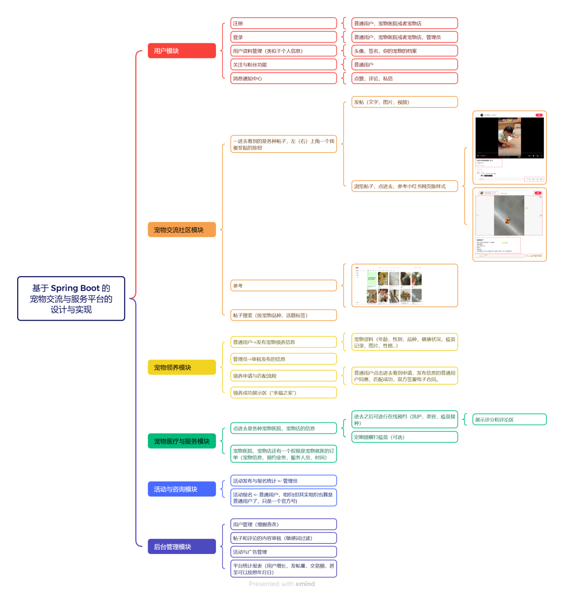

# Pamper 宠物社区平台

一个真正为爱宠设计的社区平台，提供宠物社交、领养、活动等全方位服务。

## 项目简介

Pamper 是一个综合性宠物社区平台，致力于为宠物主人提供一个交流、分享、互助的空间。平台支持用户发布宠物动态、参与社区活动、发布和浏览领养信息等功能。

## 功能特性

- **用户管理**: 用户注册、登录、个人资料管理
- **宠物档案**: 创建和管理宠物信息档案
- **社区动态**: 发布宠物动态、图片分享、点赞评论
- **领养平台**: 发布和浏览宠物领养信息
- **活动管理**: 组织和参与线上线下宠物活动
- **管理后台**: 完善的管理员后台功能（详见[管理员后台功能说明](./管理员后台功能说明.md)）

## 技术栈

### 前端
- **框架**: Vue 3
- **构建工具**: Vite
- **UI 组件库**: Element Plus
- **路由**: Vue Router
- **HTTP 客户端**: Axios
- **图表库**: ECharts

### 后端
- **框架**: Spring Boot
- **ORM**: MyBatis Plus
- **数据库**: MySQL
- **构建工具**: Maven

## 项目结构

```
Pamper/
├── Pamper-Front/           # 前端项目目录
│   ├── src/
│   │   ├── views/          # 页面组件
│   │   ├── components/     # 公共组件
│   │   ├── router/         # 路由配置
│   │   └── ...
│   ├── package.json
│   └── vite.config.js
├── src/                    # 后端源代码
│   └── main/
│       ├── java/           # Java 源代码
│       └── resources/      # 配置文件
├── avatars/                # 用户头像存储目录
├── pets/                   # 宠物图片存储目录
├── posts/                  # 帖子图片存储目录
├── activities/             # 活动图片存储目录
├── adoption/               # 领养信息图片存储目录
├── source/                 # 项目文档和设计资源
│   └── designer.png        # 系统功能思维导图
├── pom.xml                 # Maven 配置文件
├── 管理员后台功能说明.md   # 管理员功能文档
└── README.md               # 项目说明文件
```

## 功能思维导图



## 快速开始

### 环境要求

- Node.js 14+
- Java 8+
- MySQL 5.7+
- Maven 3.6+

### 后端启动

1. 克隆项目到本地
```bash
git clone <repository-url>
cd Pamper
```

2. 配置数据库
- 创建 MySQL 数据库
- 修改 `src/main/resources/application.properties` 中的数据库配置

3. 启动后端服务
```bash
mvn spring-boot:run
```

### 前端启动

1. 进入前端项目目录
```bash
cd Pamper-Front
```

2. 安装依赖
```bash
npm install
```

3. 启动开发服务器
```bash
npm run dev
```

4. 构建生产版本
```bash
npm run build
```

## 开发说明

### 前端开发

- 开发服务器默认运行在 `http://localhost:5173`
- 使用 Vue 3 Composition API 编写组件
- 遵循 Element Plus 设计规范

### 后端开发

- 后端 API 默认运行在 `http://localhost:8080`
- 使用 RESTful API 设计风格
- 遵循 Spring Boot 最佳实践

## 贡献指南

欢迎提交 Issue 和 Pull Request 来帮助改进项目。

## 许可证

[MIT License](LICENSE)

## 联系方式

如有问题或建议，欢迎联系项目维护者。